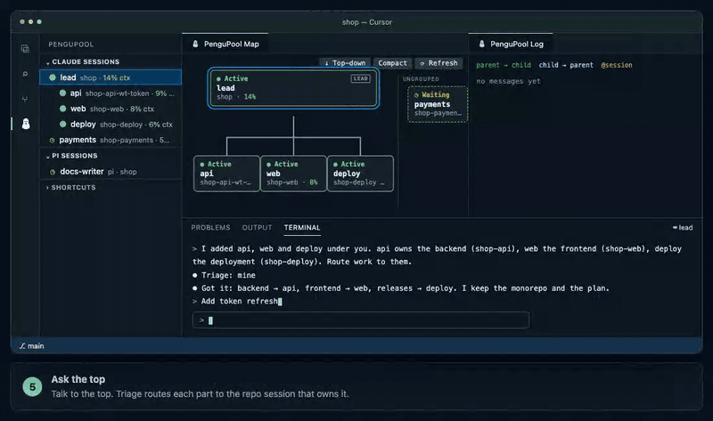

# PenguPool

**See your agent sessions in one place.** PenguPool is a VS Code/Cursor extension, backed by a local Python CLI, for managing Claude Code and pi sessions. It shows the session tree, a live map of who is talking to whom, recent messages, and a tmux-backed terminal per harness. Sessions run in tmux and keep running when you close the editor.

[Website](https://pengupool.nduwork.com) · [VS Code extension](extension/README.md) · [Contributing](.github/CONTRIBUTING.md) · [MIT license](LICENSE)



Watch all seven scenes on the [website](https://pengupool.nduwork.com/#tutorial), or read the [demo script](docs/tutorial-script.md).

## Install

One command installs the latest release: the `pengupool` CLI, the wiring for every installed harness (Claude Code, pi), the workflow tracker, and the extension in every VS Code and Cursor it finds.

```sh
curl -fsSL https://pengupool.nduwork.com/install.sh | bash
```

It needs Python 3.11+ and Make, installs [uv](https://docs.astral.sh/uv/) if missing, and offers tmux 3.2+ and the agent CLIs (y/N each). `PENGUPOOL_REF=vX.Y.Z` pins a release; `HARNESS=cc|pi|both` and `EDITOR_CLI=code|cursor` override detection. From a checkout, `bash install.sh` installs that tree.

From a checkout, Make covers the same steps:

```sh
git clone https://github.com/nduwork/pengutool.git
cd pengutool
make install        # CLI, harness wiring, tracker (HARNESS=auto|cc|pi|both)
make ext-deps       # once, to build the extension (needs Node.js/npm)
make install-all    # backend + extension (EDITOR_CLI=code|cursor to choose)
```

`make check-install` reports what is missing. `make uninstall-all` removes the extension, hooks, tracker and CLI; session transcripts, worktrees and saved grouping data are kept. Reload the editor window after installing or updating.

## Use

Open the PenguPool view (penguin icon in the Activity Bar). The Sessions tree lists Claude Code sessions, and a pi Sessions tree appears when pi is installed. Select a session to show it in the PenguPool terminal; the Map and Log panels show the selected tree.

| Key | Action |
| --- | --- |
| `Enter` / click | Open a session in the terminal |
| `n`, `a` | Start a session (in the folder or a new worktree) or add a previous one |
| `g` / drag | Group under another session |
| `r`, `x`, `c` | Rename, close, or compact a session |
| `Shift+R` | Restart & resume, e.g. after a Claude Code or pi update |
| right-click | All session actions, including Describe Role |

See the [guide](docs/guide.md) for how to brief a pool and keep work routed well.

Grouped sessions receive a short `<pengupool>` block with their tree, parent, children and role. Routing is enforced: a grouped session may message only its parent or direct children (Claude Code through a `PreToolUse` guard, pi through the bundled extension and pi-intercom), and `pengupool ctl route <id> <target>` names the next hop. Tag a session in your prompt (`@reviewer …`) to let the session you typed into message it directly until your next prompt.

Triage is checked by code. When a prompt matches a child's routing keywords (`pengupool ctl describe <id> --keywords "lexer, parser"`), name, workspace or role, the session is told `ROUTE REQUIRED` and must message that child first; the Stop hook sends it back once if it did not. A session with no role is told `ROLE REQUIRED`. Each grouped reply starts with a `Triage:` line, and "do it yourself" in a prompt turns the check off for that prompt.

PenguPool reads local Claude Code and pi session files and keeps its own state under `~/.pengupool/`. It does not need a cloud account or hosted service. The bundled [workflow tracker](workflow-tracker/SKILL.md) shows each session's current work phase under its map card.

## Develop

```sh
uv sync --group dev
uv run pytest -q
cd extension && npm ci && npm test && npm run compile
```

`pengupool` with no arguments lists the commands. `pengupool serve` streams NDJSON snapshots for the extension (`--once` prints one). `pengupool ctl` lists the control verbs the editor and pi extensions call. To propose a change, use a fork and pull request; see [CONTRIBUTING.md](.github/CONTRIBUTING.md).

## Releasing

A release is a tag. `scripts/release.sh` bumps `pyproject.toml` from conventional commits, promotes `## [Unreleased]` in `CHANGELOG.md`, tags `vX.Y.Z` and pushes; the release workflow then tests, builds the wheel and `pengupool.vsix`, and publishes the GitHub Release. One tag ships a matching backend and extension: the tag is the backend version, and the extension's own version moves only when `extension/` changed. `scripts/release-status.sh` shows what has landed and whether a release is warranted; docs/chore-only changes do not need one.

## Limits

PenguPool supports macOS/Linux and requires tmux. Adopting a running session from outside PenguPool stops that process and resumes it from its transcript, so wait for the current turn to finish. Context percentages appear only when the agent reports them. The message guard applies to supported agent messaging tools, not every possible external communication channel. pi gets the triage directive but not the end-of-turn check yet.
