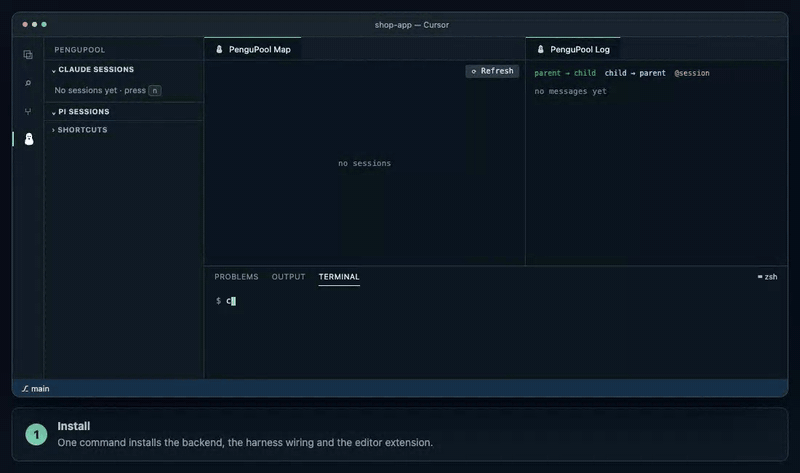
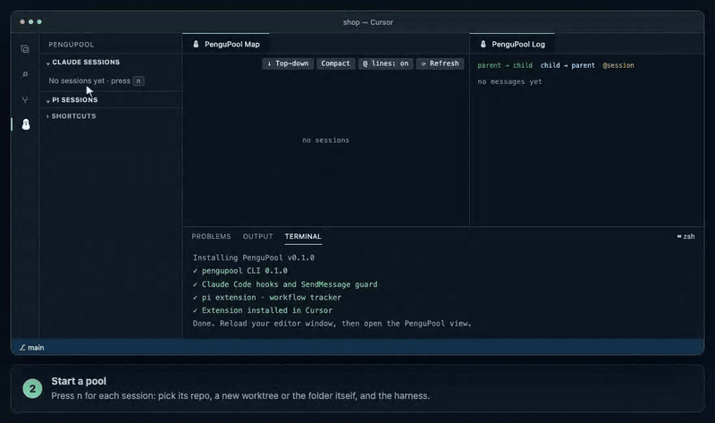
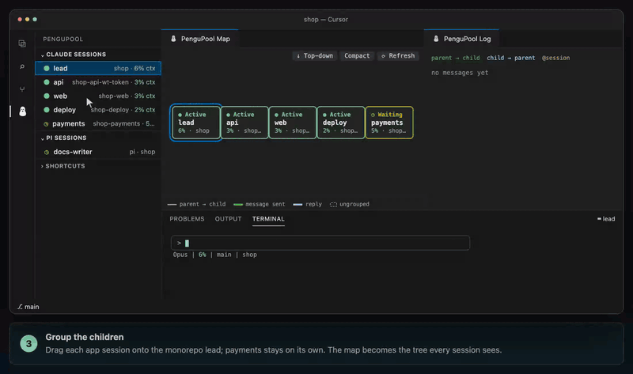
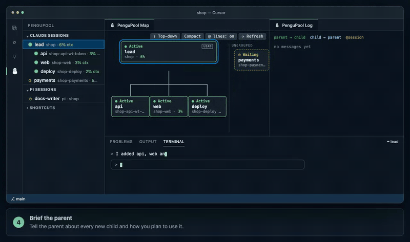
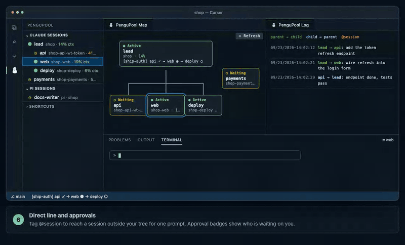
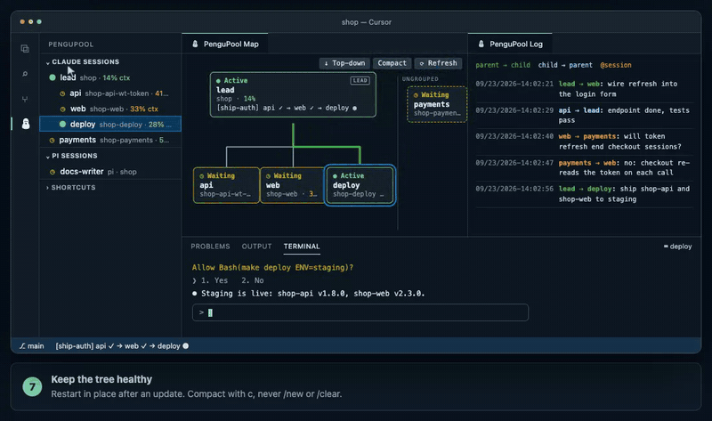

# PenguPool demo: the movie script

This is the script behind the animated tutorial on the landing page, and the running order for a live
demo. Each scene is one chapter of the player and one GIF below (`docs/assets/tutorial/`, rendered from the player by
`scripts/record_tutorial.py`). The demo project and every name in it are fictional.

**The story:** you add token refresh to the login of a small shop built from several repos. A `lead`
session sits in the monorepo that manages the apps and plans the work. Each child owns one app in its own
repo: `api` builds the endpoint in the backend (in a worktree, on its own branch), `web` wires up the
login form in the frontend, and `deploy` ships both to staging. All of it runs from one Cursor window.

**Cast:**

| Session | Harness | Repo | Owns |
| --- | --- | --- | --- |
| `lead` (root) | Claude Code | `shop`, the monorepo that manages the apps | the plan, cross-app changes |
| `api` | Claude Code | `shop-api` via a worktree, `shop-api-wt-token` | the backend service |
| `web` | Claude Code | `shop-web` | the frontend |
| `deploy` | Claude Code | `shop-deploy` | deployment to staging and production |
| `docs-writer` | pi | `shop` | the docs |
| `payments` | Claude Code | `shop-payments` | checkout and billing; **not in the tree** |

**Running time:** about 90 seconds for the loop, 5–7 minutes live.

---

## Scene 1 · Install (≈10 s)

| | |
| --- | --- |
| **Shot** | Cursor with an empty PenguPool sidebar ("No sessions yet"). The bottom panel is a plain `zsh` terminal. |
| **Action** | Type `curl -fsSL https://pengupool.nduwork.com/install.sh \| bash`. The installer reports the CLI, Claude Code hooks, pi extension, workflow tracker, and "Extension installed in Cursor". |
| **Caption** | One command installs the backend, the harness wiring and the editor extension. |
| **Live demo** | Run it for real beforehand; on stage, show the output and reload the window. Nothing to configure. |

## Scene 2 · Start a pool (≈20 s)

| | |
| --- | --- |
| **Shot** | Sidebar focused. |
| **Action** | Press `n` for each session and pick its repo. `lead` starts in `~/code/shop` with **Use selected folder**. `api` starts in `~/code/shop-api` with **Create a worktree**, so its repo shows `shop-api-wt-token`. `web` (`~/code/shop-web`) and `deploy` (`~/code/shop-deploy`) use their folders; `payments` (`~/code/shop-payments`) is another team's app that stays ungrouped; and `docs-writer` runs **pi** in the monorepo (it lands under *Pi Sessions*). Each appears as ● Active in the sidebar and as a card on the map. |
| **Caption** | Press n for each session: pick its repo, a new worktree or the folder itself, and the harness. |
| **Live demo** | Say why `api` gets a worktree: the feature lands as its own branch while the backend's main checkout stays free. The other apps work in their own folders. |

## Scene 3 · Group the children (≈10 s)

| | |
| --- | --- |
| **Shot** | Four top-level Claude sessions on the map. |
| **Action** | Drag `api` onto `lead`, then `web`, then `deploy`. Rows indent under `lead`; the map redraws into a tree. `payments` stays on its own, outside the tree. |
| **Caption** | Drag each app session onto the monorepo lead; payments stays on its own. The map becomes the tree every session sees. |
| **Live demo** | Mention `g` as the keyboard way, and that a Claude session can't be grouped under a pi one. |

## Scene 4 · Brief the parent (≈14 s)

| | |
| --- | --- |
| **Shot** | The PenguPool terminal on `lead`. |
| **Action** | Type: *"I added api, web and deploy under you. api owns the backend (shop-api), web the frontend (shop-web), deploy the deployment (shop-deploy). Route work to them."* `lead` answers `Triage: mine` and confirms: backend → api, frontend → web, releases → deploy. Hover `api`: the tooltip shows its role, which `api` set itself when it was told `ROLE REQUIRED`. |
| **Caption** | Tell the parent about every new child and how you plan to use it. |
| **Live demo** | This is the habit to sell. Without it the parent sees names but not intent. Right-click → *Describe Role…* to edit a role. |

## Scene 5 · Ask the top, watch it route (≈16 s)

| | |
| --- | --- |
| **Shot** | Map and Log side by side, terminal on `lead`. |
| **Action** | Type *"Add token refresh to login."* `lead` replies `Triage: → api, web` and sends two messages. The Log shows green `lead ⇢ api` and `lead ⇢ web`, and the same lines light green on the map; the `api` and `web` cards turn Active; the workflow chain appears: `[ship-auth] api ● → web ○ → deploy ○`. `api` finishes: blue `api ⇢ lead: endpoint done, tests pass` (the `lead`–`api` line turns milky blue), and the chain moves to `api ✓ → web ●`. |
| **Caption** | Talk to the top. Triage routes each part to the repo session that owns it. |
| **Live demo** | Point at the `Triage:` line. It's how you see the decision before any work happens. |

## Scene 6 · Direct line and approvals (≈16 s)

| | |
| --- | --- |
| **Shot** | Terminal switched to `web`. |
| **Action** | Type *"@payments will token refresh log users out of checkout?"* `payments` is not in the tree, so the routing rule would refuse this message; the tag opens a direct line for this prompt. An orange `web ⇢ payments` message appears, and `payments` answers `web` directly (also orange). Then `lead` sends `deploy` the release: `deploy`'s card turns **? Approval** because it wants to run `make deploy ENV=staging`. Click it; the terminal shows the permission prompt; approve. The card goes back to ● Active: staging is live. |
| **Caption** | Tag @session to reach a session outside your tree for one prompt. Approval badges show who is waiting on you. |
| **Live demo** | Stress that the tag lasts one prompt; for anything lasting, group the session instead. Deployments are where approvals matter most. |

## Scene 7 · Keep the tree healthy (≈12 s)

| | |
| --- | --- |
| **Shot** | Sidebar. |
| **Action** | Right-click `api` → **Restart & Resume (Shift+R)**. A "restarting api…" notification; the card blinks and comes back in the same terminal, worktree and group. Then `lead`'s context badge turns red (71%): press `c` on it to compact, and it drops back to green (9%). `deploy` reports "staging deploy done, smoke tests green" and the chain completes: `api ✓ → web ✓ → deploy ✓`. |
| **Caption** | Restart in place after an update. Compact with c, never /new or /clear. |
| **Live demo** | End on the finished chain and the full tree. |

---

## Presenter checklist

- Four fictional repos: a `shop` monorepo that manages the apps, plus `shop-api`, `shop-web`,
  `shop-deploy` and a separate `shop-payments`. No real names on screen.
- Cursor with only the PenguPool view open: Map and Log side by side, terminal panel at the bottom.
- Create the sessions live (scenes 2–3), each in its own repo. The briefing in scene 4 is the point of the talk.
- Keep prompts short and on screen long enough to read. Pause on each `Triage:` line.
- Have a small, fast task ready for `api`, and a staging target `deploy` can hit, so scenes 5–6 finish on stage.
